# FrameX


> Rootless Android performance overlay featuring live FPS metering, thermal diagnostics, and privileged gaming optimization via Shizuku.

> [!IMPORTANT]
> **Gaming Performance Mode** is optimized specifically for **Android 16** and **Vivo OriginOS/FuntouchOS** devices. For Vivo/iQOO devices, enable the **Vivo Optimization** toggle in Settings (About) first to unlock maximum gaming performance and bypass dynamic thermal downclocking. Behavior on other Android skins may vary. Use this feature at your own risk.

[](https://developer.android.com/about/versions/oreo)
[](https://kotlinlang.org)
[](LICENSE)
[](https://github.com/MaheshSharan/FrameX-Android/releases/tag/v1.5.3)

---

## What it does

FrameX shows a draggable, fully customisable overlay with live system stats on top of any app or game — including full-screen titles.

**Available metrics:** FPS · CPU frequency · CPU core clusters · RAM usage · Battery temperature · Network speed · Ping

**Performance Mode:** Optimize your device for gaming by suspending bloatware, restricting background apps, enabling advanced Do Not Disturb, and deploying per-game display/volume configurations.

---

## Requirements

- Android 8.0 (API 26) or higher
- [Shizuku](https://github.com/RikkaApps/Shizuku) installed and running
- Activate via Wireless Debugging (no PC needed on Android 11+) or ADB
- Works with the Sui module on rooted devices

---

## Screenshots

<table>
  <tr>
    <td align="center">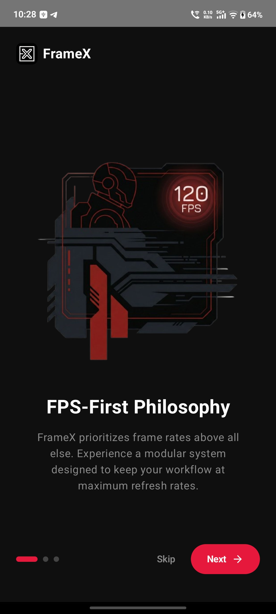<br/><sub><b>Onboarding 1</b></sub></td>
    <td align="center">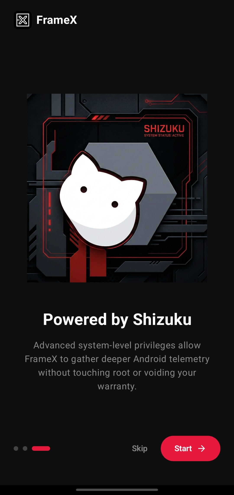<br/><sub><b>Onboarding 2</b></sub></td>
    <td align="center">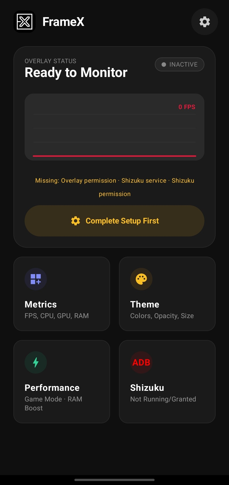<br/><sub><b>Dashboard (No Setup)</b></sub></td>
    <td align="center">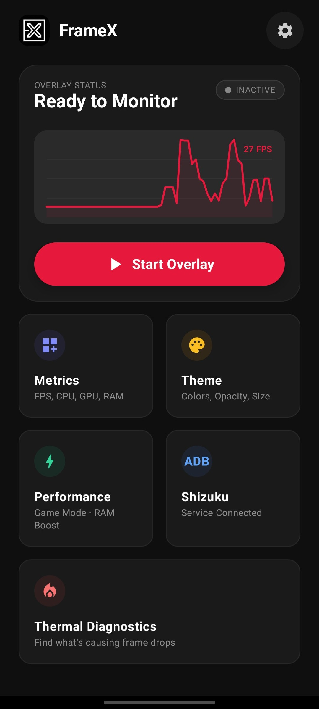<br/><sub><b>Dashboard (Running)</b></sub></td>
    <td align="center">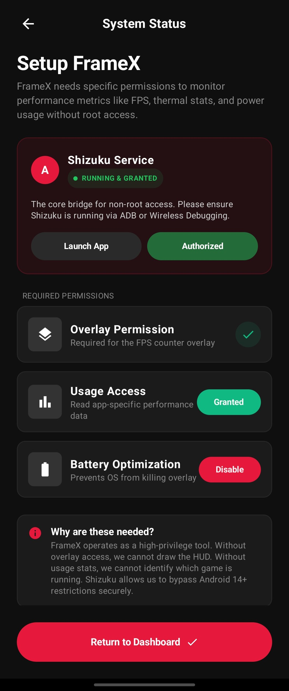<br/><sub><b>System Setup</b></sub></td>
  </tr>
  <tr>
    <td align="center">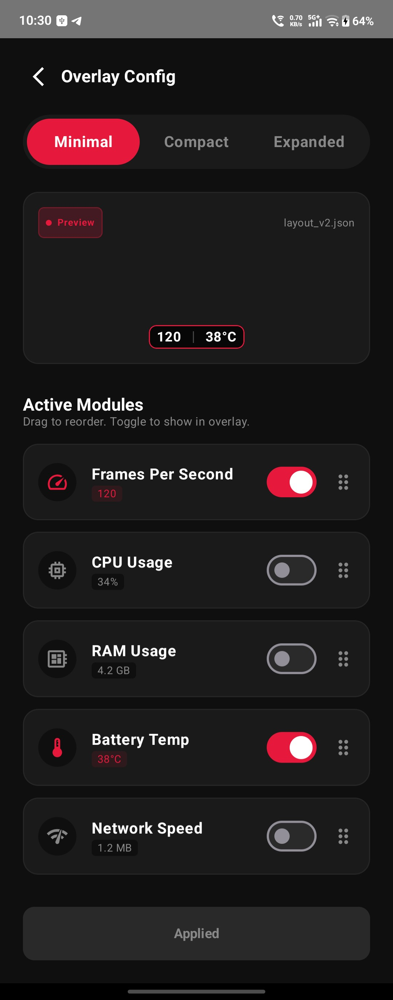<br/><sub><b>Overlay Config</b></sub></td>
    <td align="center">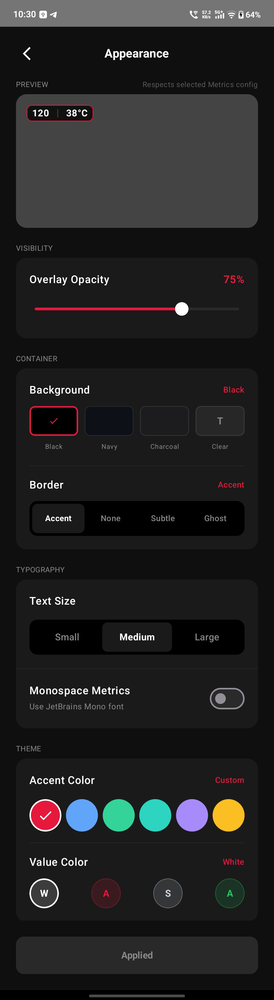<br/><sub><b>Appearance Settings</b></sub></td>
    <td align="center">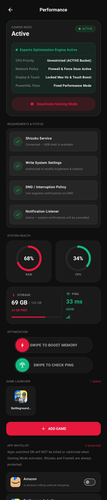<br/><sub><b>Performance Mode</b></sub></td>
    <td align="center">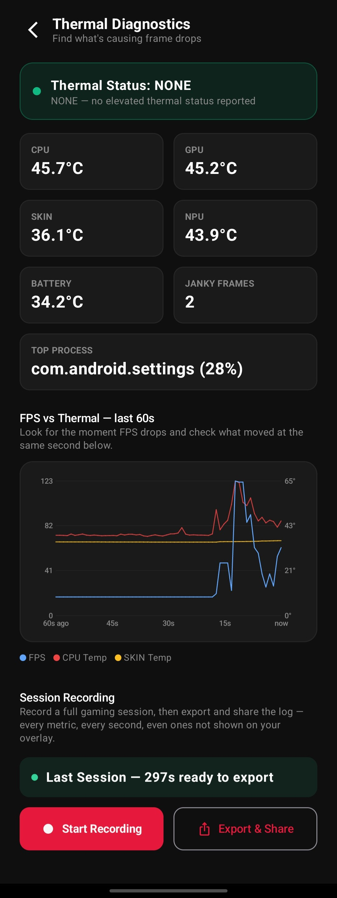<br/><sub><b>Thermal Diagnostics</b></sub></td>
    <td align="center">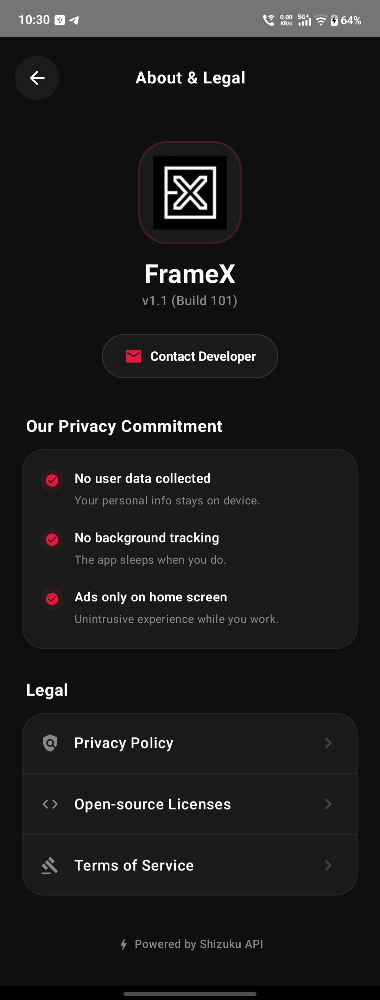<br/><sub><b>About & Legal</b></sub></td>
  </tr>
</table>

---

## How FPS is measured

FrameX measures frame rates directly at the Android OS compositor layer using privileged IPC calls to `SurfaceFlinger --timestats`. Because telemetry is gathered directly from the display pipeline, it adds **zero overhead** to game rendering threads or GPU pipelines.

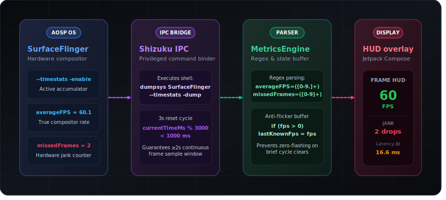

---

## Build

Standard Android Gradle project. Requires **JDK 17** and **Android SDK 34**.

```bash
git clone https://github.com/MaheshSharan/FrameX-Android.git
cd FrameX-Android
./gradlew assembleDebug
```

---

## Permissions

| Permission | Why |
|---|---|
| Draw over other apps | Display the overlay on top of games |
| Foreground service | Keep the overlay alive while the screen is on |
| Wake lock | Prevent CPU sleep during an active session |
| PACKAGE_USAGE_STATS | Identify which game is in the foreground |
| REQUEST_IGNORE_BATTERY_OPTIMIZATIONS | Survive aggressive OEM background-kill policies |
| Receive boot completed | Auto-restart overlay after reboot if it was active |
| Internet | Ping measurement to `8.8.8.8` (Google Public DNS) only |
| Kill background processes | Used to purge cached background apps during Gaming Mode activation |
| Access notification policy | Required to toggle Do Not Disturb mode automatically |
| Modify system settings | Required to deploy per-game brightness, volume, and rotation overrides |
| Foreground service (Special Use) | Ensures Gaming Mode stays active on Android 14+ |

---

## Security & Privacy

- **No data collection** — nothing is sent anywhere
- **No analytics** — no Firebase, no Crashlytics, no tracking SDKs
- **No accounts** — FrameX has no sign-in or user identity
- **No ads** — ever
- All data stays on-device

[Full Privacy Policy](https://maheshsharan.github.io/FrameX-Android/privacy-policy)

---

## Known Limitations

A small number of metrics depend on data some device vendors don't expose. See [KNOWN_LIMITATIONS.md](KNOWN_LIMITATIONS.md) for confirmed cases and affected devices.

---

## Credits

- [Shizuku](https://github.com/RikkaApps/Shizuku) by [RikkaW](https://github.com/RikkaApps) — the privileged API bridge that makes rootless system access possible. FrameX would not exist without it.

---

## License

This project is licensed under the MIT License - see the [LICENSE](LICENSE) file for details.
